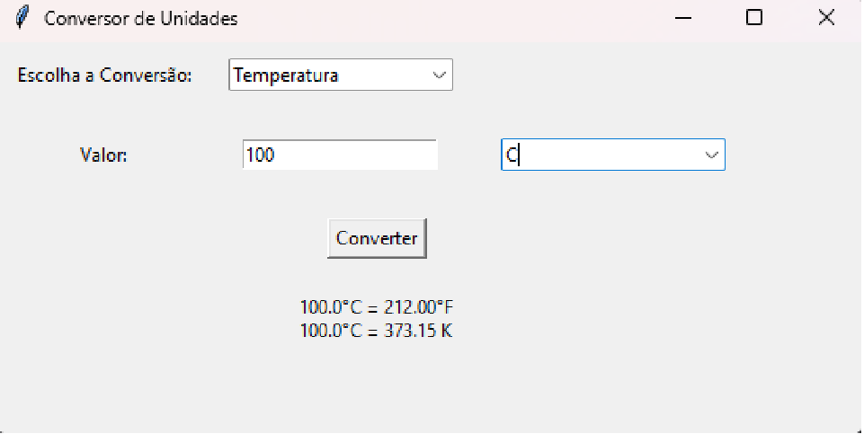

# Conversor de Unidades

Este é um projeto de conversor de unidades escrito em Python. Ele permite converter entre diferentes unidades de temperatura, distância e peso usando uma interface gráfica simples.

## Funcionalidades

- Converter temperaturas entre Celsius, Fahrenheit e Kelvin.
- Converter distâncias entre metros, quilômetros e centímetros.
- Converter pesos entre gramas, quilogramas e miligramas.

## Requisitos

- Python 3.x
- Tkinter (incluído na biblioteca padrão do Python)

## Instalação

1. Clone o repositório para o seu ambiente local:

    ```bash
    git clone https://github.com/gabryeltomaz/conversor-unidades.git
    cd conversor-unidades
    ```

2. Execute o script Python, com ou sem interface:

    ```bash
    python conversor_de_unidades_interface.py
    python conversor_de_unidades_prompt.py
    ```

## Uso

1. Escolha o tipo de conversão que deseja realizar (Temperatura, Distância ou Peso) no menu dropdown.
2. Insira o valor que deseja converter no campo apropriado.
3. Selecione a unidade de medida do valor inserido na lista de opções à direita.
4. Clique no botão "Converter" para ver o resultado da conversão.

## Exemplo



## Contatos

Feito por [Gabryel Tomaz](https://github.com/gabryeltomaz)
